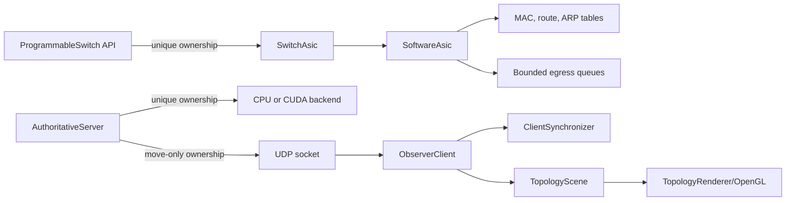
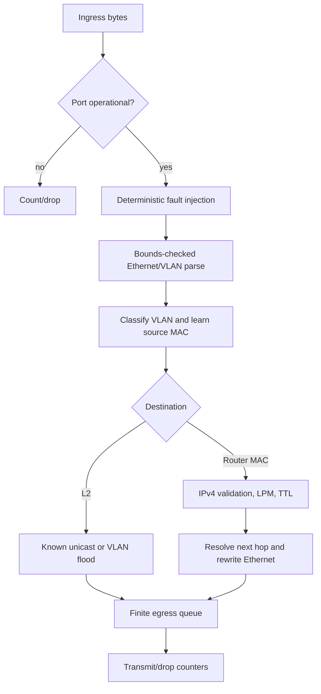

# Architecture

Silicon Switch Lab separates packet correctness, authoritative simulation,
network transport, and presentation so each can be tested without the others.
It is an educational C++17 system, not a production NOS or vendor SDK.

## Components and ownership



- Values such as MAC addresses, IPv4 addresses, VLANs, ports, and routes own
  their bytes and validate construction.
- `ProgrammableSwitch` owns one `SwitchAsic` through `std::unique_ptr`; runtime
  polymorphism keeps control intent independent of an implementation.
- `SoftwareAsic` owns ports, finite queues, MAC/ARP/route tables, fault state,
  and atomic traffic statistics.
- `AuthoritativeServer` exclusively owns its simulation backend and publishing
  socket. CPU and CUDA implementations share the `SimulationBackend` boundary.
- Socket wrappers and CUDA allocations are move-only RAII resources.
- An observer owns synchronization state and the last valid scene. OpenGL only
  reads that scene and cannot mutate authoritative state.

## Packet flow



Failures are structured results. Malformed input, missing routes/neighbors,
expired TTL, unavailable ports, full queues, and injected resource exhaustion
are distinguishable and covered by retained tests.

## Scene synchronization protocol

Every UDP state update contains magic, protocol version, message type, session
ID, sequence, timestamp, base revision, resulting revision, payload length, and
payload. A snapshot has no base revision; a delta must advance exactly from its
declared base.

```mermaid
sequenceDiagram
    participant S as CPU/CUDA server
    participant N as UDP network
    participant O as Observer
    S->>N: Snapshot(session A, seq 1, rev 1)
    N->>O: validated snapshot
    S->>N: Delta(seq 2, base 1, rev 2)
    N--xO: dropped update
    S->>O: Delta(seq 3, base 2, rev 3)
    Note over O: sequence gap; stop applying deltas
    S->>O: periodic full snapshot
    Note over O: replace scene and resume
    Note over S: process restarts with session B
    S->>O: Snapshot(session B, seq 1, rev 1)
    Note over O: discard old session and synchronize
```

Malformed, duplicate, stale, out-of-order, and revision-mismatched messages do
not modify the rendered scene. Periodic snapshots provide recovery without a
reliable ordered transport.

## Threads

The simulation server currently advances and publishes on one deterministic
thread. The OpenGL observer owns the window/context on its main thread and uses
one receive thread. A mutex protects replacement/copying of the shared scene;
atomics hold lifecycle and telemetry values. The `BoundedQueue` uses a mutex
and condition variable with explicit close semantics so waiting consumers can
terminate. No OpenGL call is made from the receiver thread.

## Four-computer deployment

The RTX desktop is authoritative and publishes to three configured peer
addresses. Each computer creates its own OpenGL context and displays a local
window from synchronized logical scene state. This is state replication, not
remote desktop or OpenGL-context sharing. See `SCENARIO_34.md` for addresses,
ports, firewall rules, and launch commands.

## Important tradeoffs

- UDP avoids head-of-line blocking for frequent replaceable scene state, while
  sequence/revision checks and periodic snapshots make loss explicit.
- Full topology payloads are presently carried in both snapshots and deltas.
  This keeps correctness simple but is a future bandwidth optimization target.
- CUDA is optional and CPU is the deterministic reference. Small scenes can be
  slower on CUDA because launch, synchronization, and copy overhead dominate.
- Linear/map-based tables favor clarity and deterministic behavior over the
  scale of production ASIC data structures.
- OpenGL 2.1 immediate mode maximizes compatibility for the lab; it is not a
  claim of modern rendering-engine performance.
- The trusted-LAN protocol has validation but no authentication or encryption.
  It must not be exposed directly to an untrusted network.
